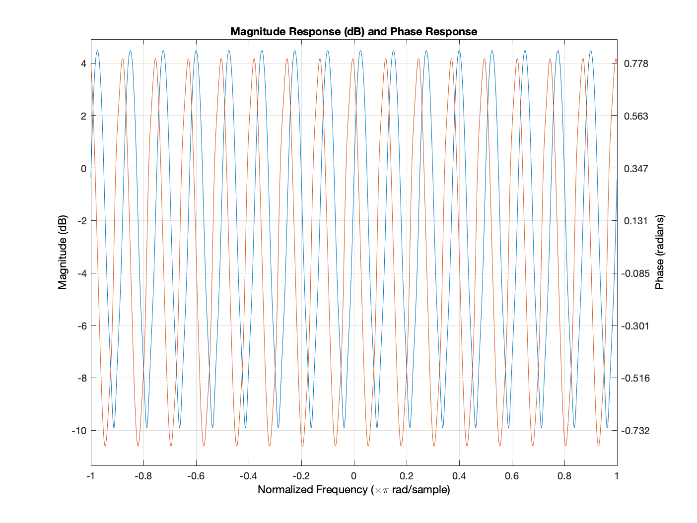

# Cyclops Baseband PHY Performance

The following sections describe the performance of the Cyclops Rev1 PHY under different scenarios.  Metrics considered include the uncoded BER rate and the EVM immediatly after Symbol Timing Recovery (TR) and before the final demodulation.

Note:
 - The sweep was conducted for the entire domain of the blue (ideal) line.  The absence of datapoints in the BER plot signifies that no bit errors were detected.
 - Before points where no errors were detected, there may be what appears to be a momentary uptick in the BER.  This is likely due to very low error rate being difficult to estimate without longer test runs.
 - BER only includes packets that were successfully detected and where the modulation field was interpreted correctly.  See the failure graphs for how many trials were excluded for each data point.
 - The after TR EVM is only valid when no CFO or phase offset is present.
 - The ideal EVM in these plots is a bit off at the moment, particularly for low SNR.

 The following plots are based on a BER sweep with 15 trials per point.  Each trial consisted of a packet being transmitted twice with a gap in between transmissions.

 The runs were conducted between July 11 and July 14, 2020 with commit 2ce053330be6b412ac5f6afa005150617b5773c0 modified to enable the different scenarios.

## Summaries:
- [BER Plots](berPlots.md)
- [EVM Plots](evmPlots.md)
- [Failure Plots](failuresPlots.md)

## Per Config:
- AWGN Channel - NO CFO, No Timing Error
    - [16QAM](AWGN_NoImparements_16QAM.md)
    - [QPSK](AWGN_NoImparements_QPSK.md)
    - [BPSK](AWGN_NoImparements_BPSK.md)
- AWGN Channel - Random Carrier and Timing Phase Offset
    - [16QAM](AWGN_NoImparements_RandomInitPhase_16QAM)
    - [QPSK](AWGN_NoImparements_RandomInitPhase_QPSK)
    - [BPSK](AWGN_NoImparements_RandomInitPhase_BPSK)
- AWGN Channel - 2 KHz CFO, -1.6 KHz Timing Frequency Offset
    - [16QAM](AWGN_16QAM)
    - [QPSK](AWGN_QPSK)
    - [BPSK](AWGN_BPSK)
- cost207RAx4 Channel - 2 KHz CFO, -1.6 KHz Timing Frequency Offset
    - [16QAM](cost207RAx4_16QAM)
    - [QPSK](cost207RAx4_QPSK)
    - [BPSK](cost207RAx4_BPSK)

## cost207RAx4 Model
 The cost207RAx4 realziation was the same in each case and was derived from the stdchan cost207RAx4 model built into Matlab.  The channel emulation filter has the following configuration:
 - Channel Delays (Symbols): [0 4 8 12]
- Average Path Gain (dB): [0 -2 -10 -20]

The frequency Response of the cost207RAx4 channel is shown below:
