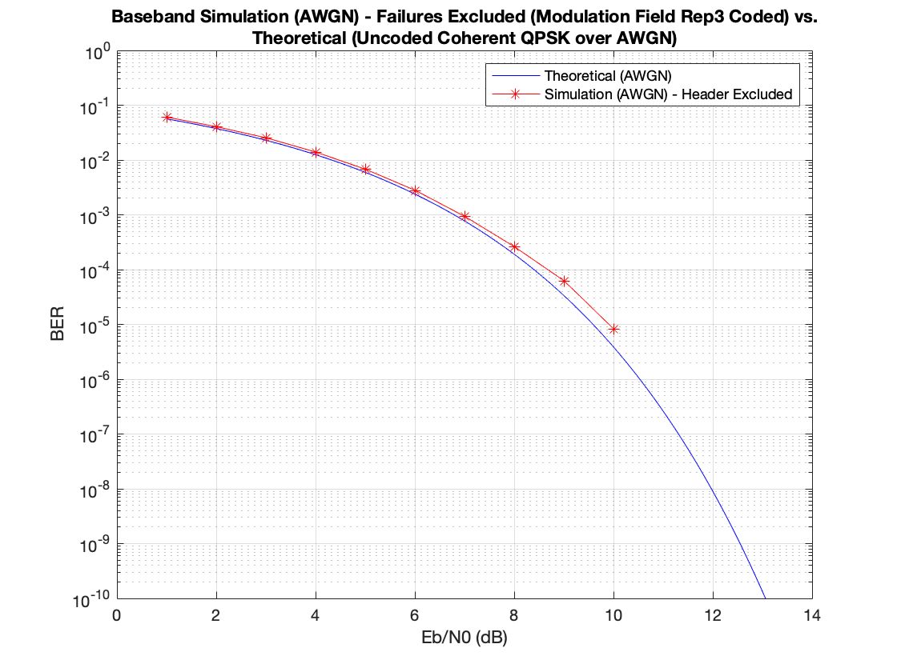
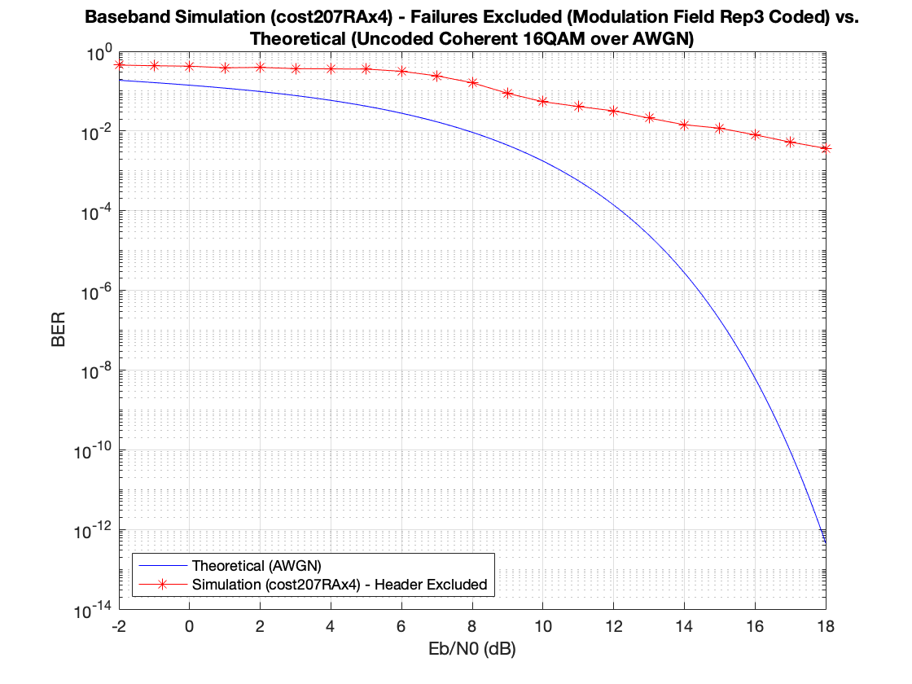
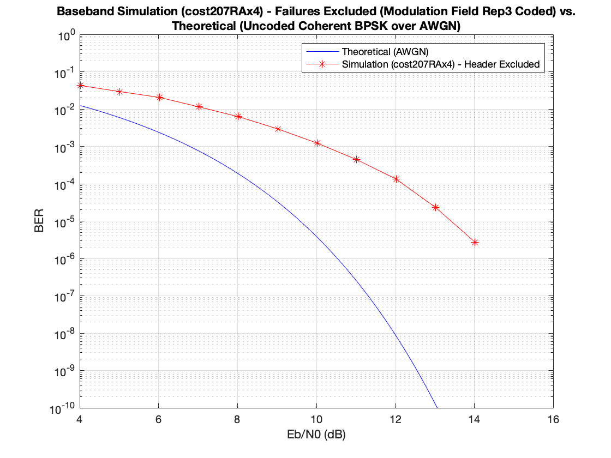

# BER Summary

## Contents
- [AWGN Channel - NO CFO, No Timing Error](#awgn-channel---no-cfo-no-timing-error)
- [AWGN Channel - Random Carrier and Timing Phase Offset](#awgn-channel---random-carrier-and-timing-phase-offset)
- [AWGN Channel - 2 KHz CFO, -1.6 KHz Timing Frequency Offset](#awgn-channel---2-khz-cfo--1.6-khz-timing-frequency-offset)
- [cost207RAx4 Channel - 2 KHz CFO, -1.6 KHz Timing Frequency Offset](#cost207RAx4-channel---2-khz-cfo--1.6-khz-timing-frequency-offset)

## AWGN Channel - NO CFO, No Timing Error
### 16QAM

### QPSK

### BPSK

## AWGN Channel - Random Carrier and Timing Phase Offset
### 16QAM

### QPSK

### BPSK

## AWGN Channel - 2 KHz CFO, -1.6 KHz Timing Frequency Offset
### 16QAM

### QPSK

### BPSK

## cost207RAx4 Channel - 2 KHz CFO, -1.6 KHz Timing Frequency Offset
### 16QAM

### QPSK

### BPSK
