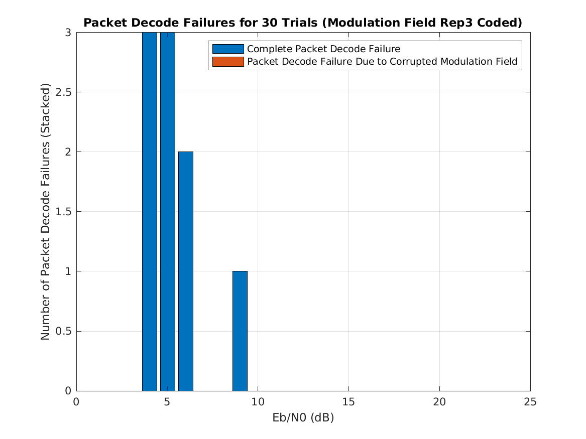
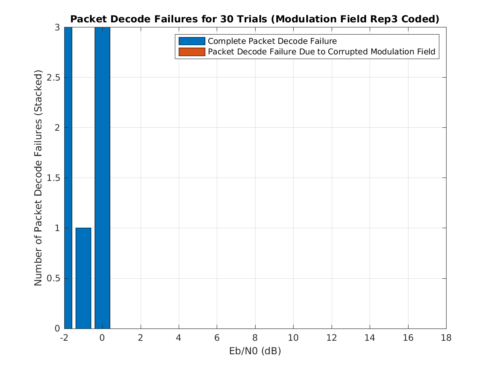
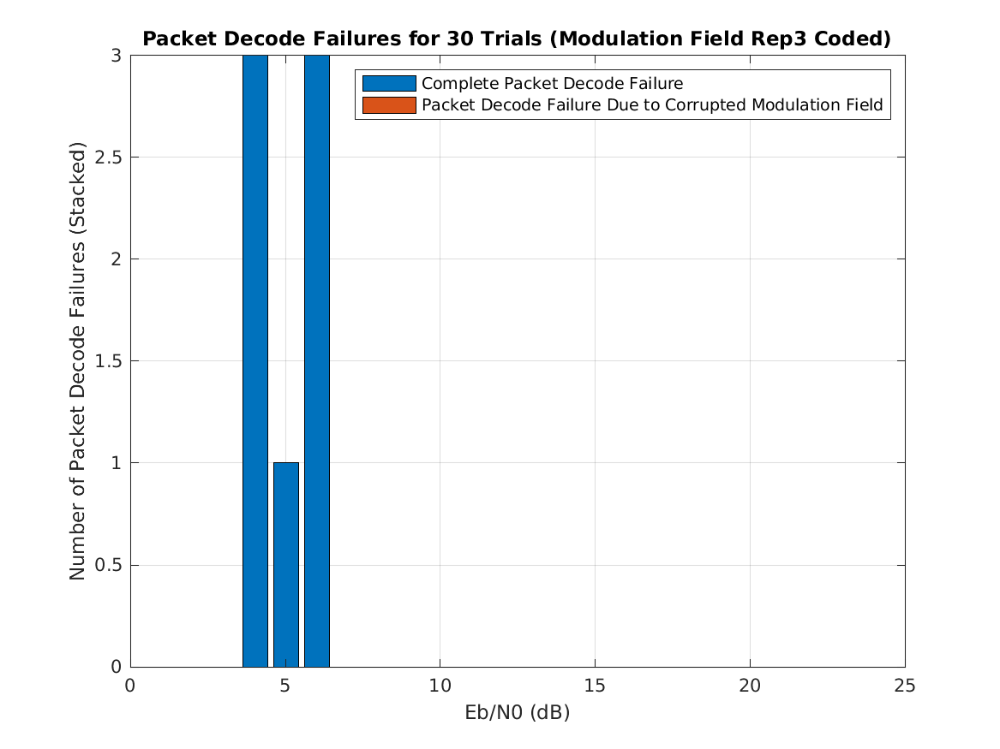

# Failures Summary

Scenario | 16QAM | QPSK | BPSK
-------- | ----- | ---- | -----
AWGN Channel - NO CFO, No Timing Error |  |  | 
AWGN Channel - Random Carrier and Timing Phase Offset |  |  | 
AWGN Channel - 2 KHz CFO, -1.6 KHz Timing Frequency Offset |  |  | 
cost207RAx4 Channel - 2 KHz CFO, -1.6 KHz Timing Frequency Offset |  |  | 